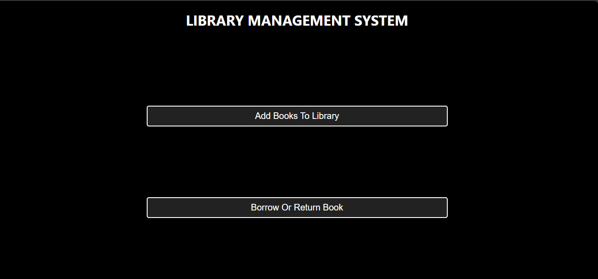
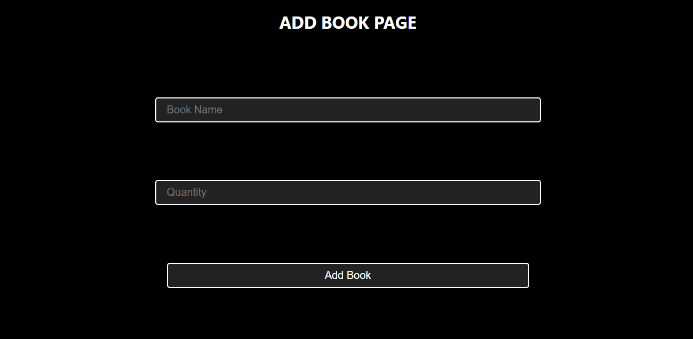
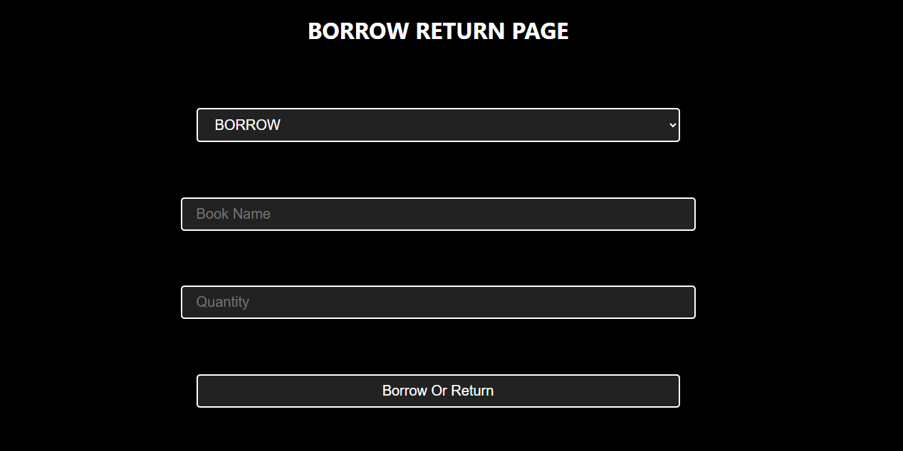

# Week3Activity


The Library Management System is a web-based application designed to streamline library operations for both users and librarians. It allows users to borrow and return books effortlessly, while librarians can manage the collection and user details. This system provides a user-friendly interface and ensures data integrity with robust backend support.


**FEATURES :**


**User Features :**

- **Borrow Books:** Check out available books with ease.

- **Return Books:** Manage returns.

- **Track Borrowed Books:** View borrowed books and their due dates.


**Librarian Features :**

- **Add Books:** Add new books to the library catalog.

- **Remove Books:** Delete outdated or unavailable books from the system.

- **User Management:** View user activity.

**SCREENSHOTS :**




**FILE STRUCTURE :**

library-management-system :         


```
library-management-system/
├── Backend/
│   ├── Database/
│   │   ├── DatabaseConnector.js         # Handles database connection
│   │   ├── InitializeDatabase.js        # Initializes database tables and schema
│   ├── Server/
│       ├── Messages/
│       │   ├── InsertBook.js            # Handles book insertion logic
│       ├── MessageHandler.js            # Processes server messages
│       ├── Server.js                    # Main server logic
├── Common/
│   ├── Enumerations/
│   │   ├── Operations.js                # Enumerations for common operations
│   ├── Globals.js                       # Global constants and settings
│   ├── Navigator.js                     # Handles navigation logic
├── Frontend/
│   ├── Pages/
│   │   ├── AddBookPage.html             # HTML for adding a book
│   │   ├── AddBookPage.js               # JS logic for adding a book
│   │   ├── BorrowReturnPage.html        # HTML for borrowing/returning books
│   │   ├── BorrowReturnPage.js          # JS logic for borrow/return operations
│   │   ├── HomePage.html                # HTML for homepage
│   │   ├── HomePage.js                  # JS logic for homepage
|   |   ├──SendRequest.js
│   ├── Styles.css                       # Common styling for all pages
├── node_modules/                        # Dependencies for the project
├── index.html                           # Entry point of the web application
├── IPCHandler.js                        # Handles inter-process communication
├── Main.js                              # Main application logic
├── package.json                         # Node.js project configuration
├── package-lock.json                    # Lock file for dependencies
└── README.md                            # Documentation file
```
